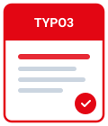
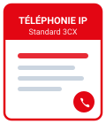

Bienvenue sur le centre de connaissances du <strong>Service du Numérique</strong>. Cette plateforme rassemble l'ensemble des guides d'utilisation, procédures informatiques et manuels d'administration des solutions applicatives.

---

## 📚 Accès direct aux documentations

  <a href="Guide%20utilisateur%20TYPO3/index.md" class="doc-card">
    
    

      
Guide Utilisateur TYPO3

      
Manuel d'utilisation et de gestion des contenus sous le CMS TYPO3 (arborescence, médias, création de pages et publication).

      
Accéder au guide &rarr;

    

  </a>

  <a href="Guide%20utilisateur%20Nextcloud/index.md" class="doc-card">
    
    

      
Guide Utilisateur Nextcloud

      
Manuel d'utilisation de la plateforme de stockage en ligne, partage collaboratif et synchronisation de documents.

      
Accéder au guide &rarr;

    

  </a>

  <a href="Procedure%20Acces%20Distant%20VPN/index.md" class="doc-card">
    
    

      
VPN &amp; Accès Distant

      
Procédure de connexion sécurisée à distance, configuration FortiClient et consignes de sécurité réseau.

      
Accéder au guide &rarr;

    

  </a>

  <a href="Manuel%20Telephonie%20IP/index.md" class="doc-card">
    
    

      
Manuel Téléphonie IP (3CX)

      
Guide pratique pour la gestion des postes téléphoniques, transferts d'appels et configuration de la messagerie.

      
Accéder au guide &rarr;

    

  </a>

